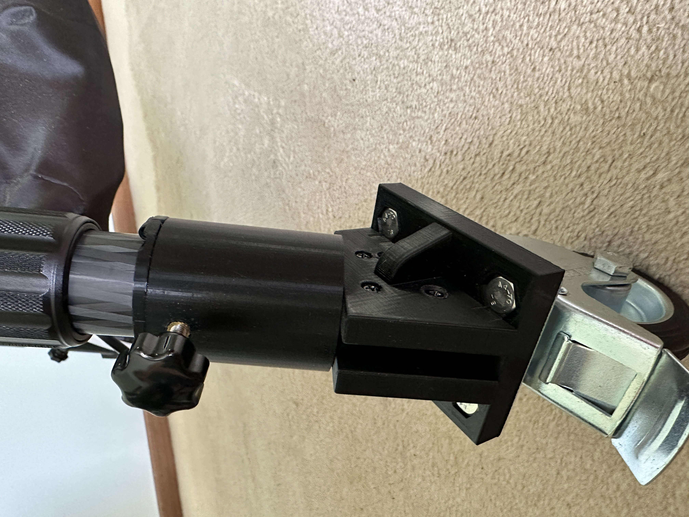
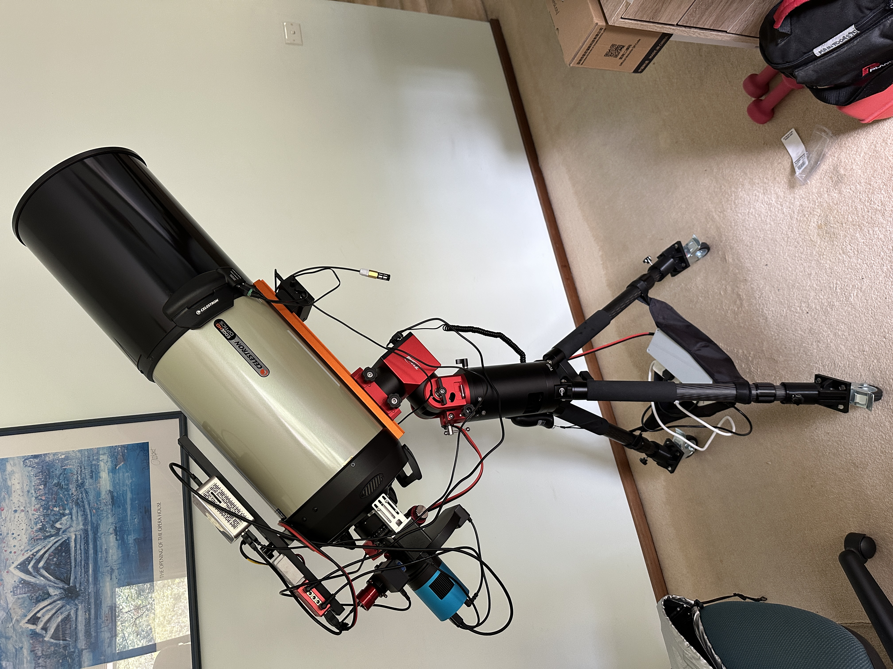
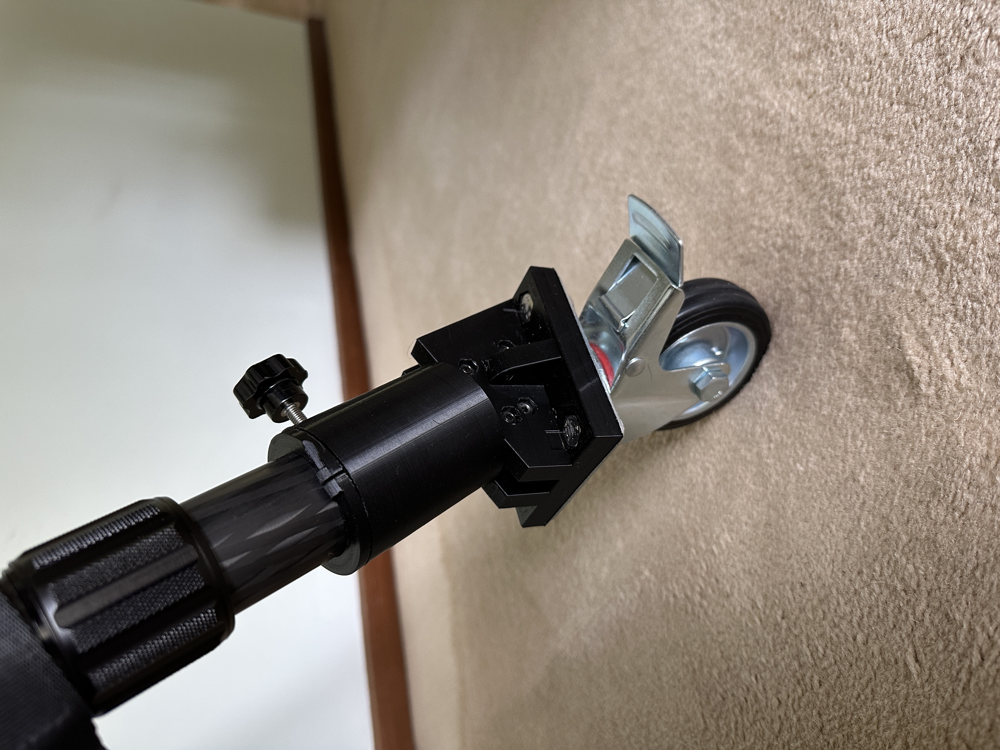

# 🧲 TC40 Tripod Caster Adapter (FreeCAD Project)

This project provides a modular, 3D-printable collar and base-plate adapter that attaches removable castor wheels to the **ZWO TC40 tripod**, used with a **Celestron EdgeHD 9.25** or similar astrophotography rig.  
The goal is to make rolling the fully-built telescope in and out of observing position easier while maintaining rigidity and vibration control once the wheels are removed and imaging begins.

---

## 📸 Latest Implementation (v2)

| Preview | Description |
|:--:|:--:|
|  | *Detail of the wheel adapter showing the collar and M5 knob securing the tube.* |
|  | *Celestron EdgeHD 9.25 mounted on ZWO TC40 tripod with wheel adapters fitted.* |
|  | *Compression collar fitted on tripod leg — no damage to carbon fiber, easy install/remove.* |

---

### 🆕 Update (Nov 2025)

An **M5 knob** has been added to stabilize the adapter and prevent the wheel assembly from detaching when the tripod is lifted.  
This replaces earlier tooth-locking ideas with a **compression-collar interface** that protects the TC40 leg and allows quick fitting and removal.

---

## ✨ Features

- Split-collar compression design — no marking or marring of carbon-fiber legs  
- M5 knob adds positive retention without tools  
- Spacer seat locks onto TC40 leg tip for precise registration  
- Fully parametric spreadsheet for quick adaptation to other tripods or wheels  
- Modular design: collar and base print separately for faster, cleaner prints  

---

## 🧮 Parametric Spreadsheet (FreeCAD)

> **IMPORTANT:**  
> The **Base Plate** and **Bolt Pattern** parameters define the physical bolt layout of your castor wheel.  
> Adjust these to match your specific hardware before exporting STL.

### Core Dimensions
| Parameter | Value | Description |
|---|---|---|
| `tube_ID` | 41 mm | Inner diameter of main adapter tube |
| `tube_wall` | 4.5 mm | Tube wall thickness |
| `tube_len` | 50 mm | Tube length |
| `leg_angle_deg` | 27° | Tripod leg angle |
| `tube_OD` | `tube_ID + 2 × tube_wall` | Derived outer diameter |

### Base Plate (Example Values)
| Parameter | Value | Description |
|---|---|---|
| `base_x` | 82 mm | Base plate X dimension |
| `base_y` | 68 mm | Base plate Y dimension |
| `base_thick` | 12 mm | Base thickness |

### Bolt Pattern
| Parameter | Value | Description |
|---|---|---|
| `bolt_x_centers` | 60 mm | Bolt spacing (X) |
| `bolt_y_centers` | 42 mm | Bolt spacing (Y) |

### Gussets
| Parameter | Value | Description |
|---|---|---|
| `gus_thick` | 6 mm | Gusset thickness |
| `gus_len` | 14 mm | Gusset length |
| `gus_height` | 14 mm | Gusset height |

### Bracket
| Parameter | Value | Description |
|---|---|---|
| `bracket_angle` | 60° | Bracket angle |
| `bracket_base` | `base_y / 2` | Centered location |
| `bracket_holeHeight` | `gus_height + 10 mm` | Keeper-bolt Z height |
| `bracket_thickness` | 10 mm | Bracket thickness |

### Collar (Tripod Interface)
| Parameter | Value | Description |
|---|---|---|
| `CollarTopHeight` | 4 mm | Top lip height |
| `CollarOffset` | 0.3 mm | Fit tolerance |
| `SpacerOD` | `tube_ID − 2 × CollarOffset` | Spacer outer diameter |
| `SpacerID` | 36.2 mm | TC40 leg diameter |
| `SpacerHeight` | 15 mm | Spacer depth |

### Post / Guide (Split Collar Alignment)
| Parameter | Value | Description |
|---|---|---|
| `guidewidth` | 1.1 mm | Guide width |
| `guidelength` | 5 mm | Guide length |
| `guidedepth` | 3 mm | Guide depth |
| `guidetolerance` | 0.2 mm | Clearance |
| `postwidth` | `guidewidth − guidetolerance` | Post width |
| `postlength` | 4 mm | Post engagement |
| `postdepth` | `guidedepth − guidetolerance` | Post depth |

### Hardware Reference
| Parameter | Value | Description |
|---|---|---|
| `m4_hole` | 4.3 mm | M4 clearance |
| `m4_head` | 7 mm | M4 socket-head diameter |
| `m4_head_depth` | 3 mm | M4 head recess depth |
| `m4_nut` | 8.2 mm | M4 hex-nut width |
| `m4_nut_depth` | 3.5 mm | M4 nut pocket depth |
| `m5_insert` | 6.7 mm | Heat-set insert diameter |
| `m6_hole` | 6.6 mm | Clearance |
| `m6_head` | 10 mm | Head diameter |
| `m6_nut` | 11.6 mm | Nut width |

---

## 🧪 Test Bodies (Print Before Final Part)

| FreeCAD Body | Purpose |
|---|---|
| **TestTube** | Confirms collar/tube fit on TC40 tripod leg |
| **TestBase** | Verifies bolt-hole spacing matches castor wheel |

> ✅ **Tip:** Print these first to confirm fit before committing to the 10-hour full print.

---

## 🖨️ Printing Recommendations

| Setting | Recommendation |
|---|---|
| **Material** | PETG (best), PLA+ (prototype), ASA/ABS (outdoor use) |
| **Perimeters** | 4 |
| **Infill** | 25 – 40 % |
| **Orientation** | Split face down, axis vertical |
| **Supports** | Not required |

---

## 🧰 Hardware Needed

- **M5 × 20 mm knob-screw** for tube locking (prevents wheel detachment)  
- **M5 brass insert** (6.7 mm diam × 5–6 mm deep) or captive nut  
- M2 × 8 mm bolt + M2 heat-set insert for collar keeper (optional)  
- Castor wheels + M6/M8 bolts as per wheel base pattern  

---

## 📦 Files in Repository

```
.
├── images
│   ├── IMG_4484.JPG
│   ├── IMG_4485.JPG
│   └── IMG_4486.JPG
├── README.md
├── stl
│   ├── Base.stl
│   ├── CollarLeft.stl
│   ├── CollarRight.stl
│   ├── TestBase.stl
│   ├── TestTube.stl
│   └── Tube.stl
├── TC40CastorAdapter.20251110-144419.FCBak
└── TC40CastorAdapter.FCStd
```

## 🧠 Notes

- The **compression-collar** design works well without teeth or metal inserts.  
- The **M5 knob** provides strong, smooth compression and keeps the wheel adapter secure when lifting the tripod.  
- The **3D-printed collar** protects the carbon-fiber surface of the TC40 leg while holding firm.  
- The adapter balances strength, modularity, and printability — ideal for field use.

---

**Author:** Mark Pinnuck  
**Last Updated:** November 2025  
**License:** CC BY-SA 4.0  
